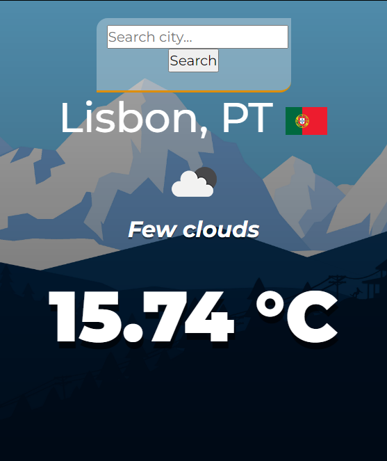

# Weather-App :sunny:

> Weather application that displays the weather in a given city.

---

## Description

This weather app was made in two ways: one with a GUI using Tkinter module and other on a Website using Flask module.
The website code is in the "site" folder.

The app communicates with the [OpenWeather](https://openweathermap.org/) API to retrieve the current weather information in a location and display it on screen.

To use it, just type in the name of a city and click on the "Search Weather" button. If the name is invalid, a message box is displayed.

The info displayed is:
- City and Country name; :earth_africa:
- Weather description and icon; :partly_sunny:
- Temperatures (current, min and max); :fire:

---

## Author Info

- Twitter - [@andre_j3sus](https://twitter.com/andre_j3sus)
- Website - [André Jesus](https://sites.google.com/view/andre-jesus/p%C3%A1gina-inicial)

[Back To The Top](#weather-app-:sunny:)
